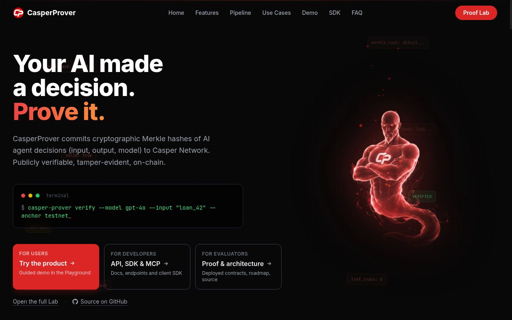
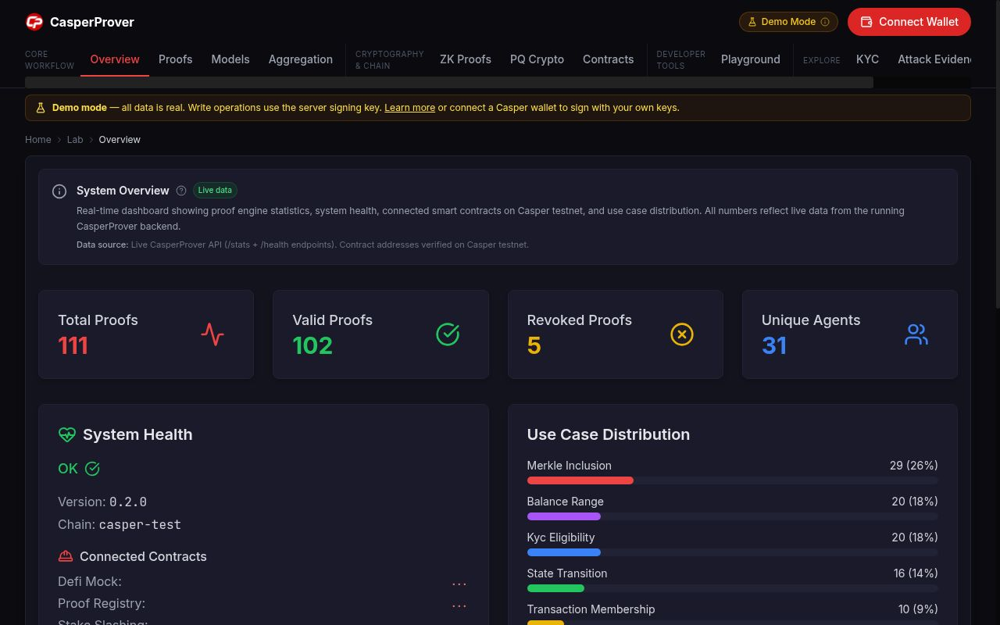
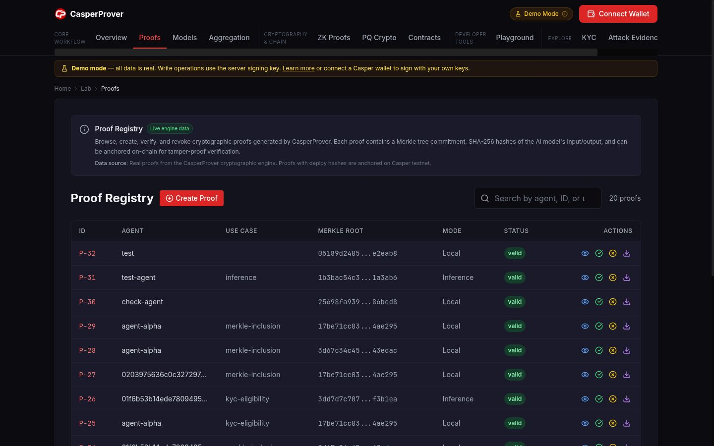
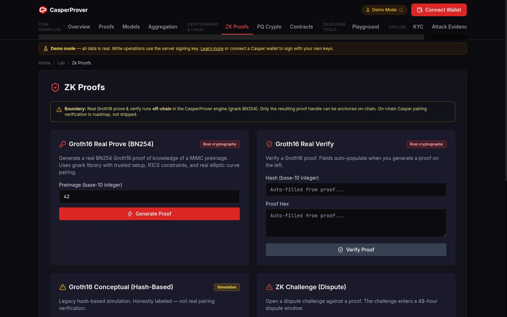
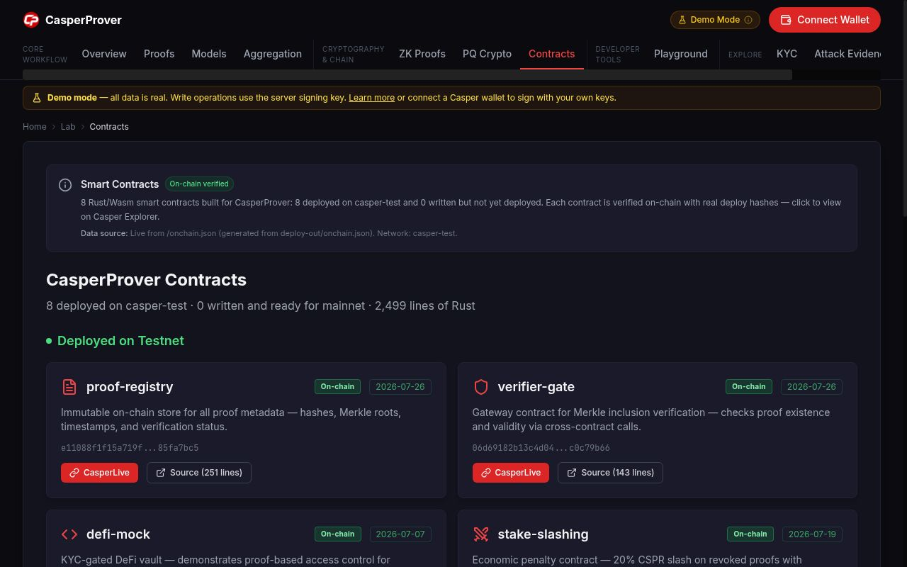
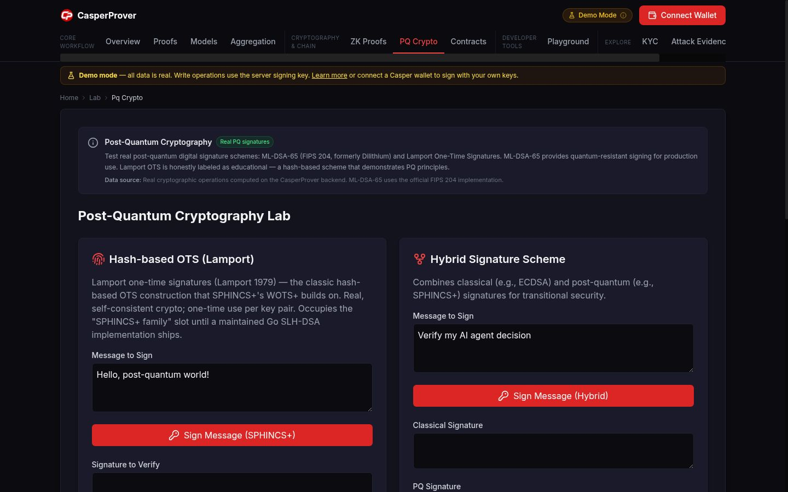
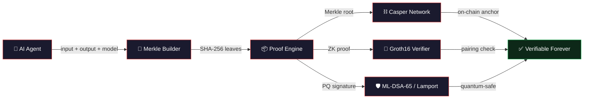
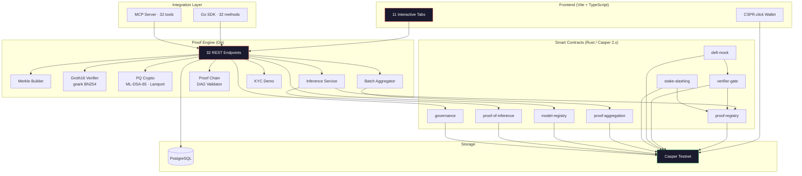

<a id="readme-top"></a>

<div align="center">

# CasperProver

**Cryptographic audit-trail engine for AI agent decisions — Merkle-anchored on-chain, ZK-augmented, post-quantum ready**

*Commit an agent's inputs & outputs to Casper. Verify the commitment in milliseconds. ZK & PQ layers optional; ZK verification is off-chain (gnark).*

[](https://github.com/anna-stolbovskaja/CasperProver/actions/workflows/check.yml)
[](https://github.com/anna-stolbovskaja/CasperProver/actions/workflows/verify.yml)
[](https://github.com/anna-stolbovskaja/CasperProver/actions/workflows/secret-scan.yml)
[](https://go.dev)
[](https://casper.network)
[](LICENSE)
[](https://casperprover.xyz/lab)


[**Live Demo →**](https://casperprover.xyz/lab) · [Judge Verification](docs/JUDGE_GUIDE.md) · [Architecture](docs/ARCHITECTURE.md) · [SDK](docs/SDK.md) · [Status & Roadmap](docs/KNOWN_LIMITATIONS.md)

**Three entry points on the landing page:**
[Try the product](https://casperprover.xyz/lab/playground) ·
[For developers (API / SDK / MCP)](https://casperprover.xyz/docs/api) ·
[For evaluators (Proof & architecture)](https://casperprover.xyz/lab/contracts) ·
[Video script](docs/VIDEO_SCRIPT.md)

</div>

---

> **9 smart contracts** live on Casper testnet · **248+ transactions** on-chain · **32 API endpoints** · **32 SDK/MCP tools** · **11 interactive lab tabs** · Real Groth16 ZK proofs (off-chain, gnark BN254 MiMC) · Post-quantum cryptography (ML-DSA-65 + Ed25519 hybrid) · Merkle-anchored proof-chain DAG

## 📸 Screenshots

| Landing | Lab Overview | Proof Registry |
|---|---|---|
|  |  |  |

| ZK Proofs | Smart Contracts | PQ Crypto |
|---|---|---|
|  |  |  |

> Live at [casperprover.xyz](https://casperprover.xyz)

---

## Why This Matters

AI agents are executing critical workflows — KYC checks, financial decisions, compliance rules. But there is **no tamper-evident audit trail**. Without one, you have to re-run the model to check a past decision, and even that only proves the model can produce the same output — not that this particular decision was made.

CasperProver closes the **audit-trail** gap. It does **not** prove the model's internal computation was correct (that is a research-grade zkML problem — see Growth Potential). It commits inputs, outputs and model fingerprint to Casper, so any later party can verify the record has not been altered:

| Without CasperProver | With CasperProver |
|---|---|
| Re-run the model to check a past decision | Verify the Merkle inclusion proof in milliseconds |
| Trust the agent operator's log | Verify the Merkle root is anchored on-chain |
| Black-box, mutable log | Merkle-anchored, tamper-evident record |
| Centralized log (mutable) | Immutable on-chain commitment |
| No quantum resistance | Post-quantum signing (ML-DSA-65, Lamport OTS) |
| No economic penalties | Stake-and-slash for dishonest agents |

---

## Proof Lifecycle



**How it works:**
Given `f(x) = y` with model `M`, CasperProver produces `π = MerkleProof(H(x), H(y), H(M))` where `H = SHA-256`. The root is committed on-chain; the inclusion proof is stored and queryable forever without re-running the model.

For stronger guarantees, the same commitment can be:
- **ZK-augmented** with real BN254 Groth16 circuits (gnark) — proofs generated & verified **off-chain** in the engine; the resulting proof handle is stored alongside the Merkle root. On-chain Casper verification of Groth16 is not implemented.
- **Post-quantum signed** with hybrid Ed25519+ML-DSA-65 or Lamport OTS
- **Chained** into a DAG with cycle detection and input continuity validation

---

## Key Features

| Feature | Description | Status |
|---|---|---|
| **Merkle Proofs** | SHA-256 + Merkle tree, <50ms generation | ✅ Live |
| **Real ZK Proofs (off-chain)** | BN254 Groth16 via gnark — R1CS circuits, trusted setup, pairing verification runs in the engine; on-chain Casper Groth16 verifier is roadmap | ✅ Live (off-chain) |
| **Post-Quantum Crypto** | ML-DSA-65 (FIPS 204), hybrid Ed25519+ML-DSA, Lamport OTS | ✅ Live |
| **Batch Aggregation** | Hash-chain aggregation with Postgres persistence | ✅ Live |
| **Proof-Chain DAG** | Multi-step proof validation: cycle detection, input continuity, single root | ✅ Live |
| **On-Chain Anchoring** | 9 smart contracts on Casper testnet | ✅ Live |
| **Stake & Slash** | Economic penalties for revoked proofs, permissionless reporting bounty | ✅ Live |
| **KYC Gating** | Proof-based DeFi access control with cross-contract verification | ✅ Live |
| **SDK (Go)** | 32 methods, 1:1 API mapping | ✅ Live |
| **MCP Server** | 32 tools for AI agent frameworks | ✅ Live |
| **Wallet Connect** | CSPR.click SDK — Casper Wallet, Ledger, MetaMask Snap, Google SSO | ✅ Live |
| **Interactive Lab** | 10-tab proof explorer with real API calls | ✅ Live |

---

## Architecture



---

## Quickstart

**Prerequisites:** Go 1.24+, access to Casper testnet node

```bash
git clone https://github.com/anna-stolbovskaja/CasperProver
cd CasperProver
go mod download
go run ./engine/cmd/...
```

**Submit a proof:**
```bash
curl https://casperprover-api-ylsh.onrender.com/proofs \
  -H "Content-Type: application/json" \
  -d '{
    "agent": "agent-alpha",
    "input": "loan_approval_data",
    "output": "approved_with_conditions",
    "model": "gpt-4o"
  }'
```

**Real ZK proof:**
```bash
curl https://casperprover-api-ylsh.onrender.com/zk/groth16-real/prove \
  -H "Content-Type: application/json" \
  -d '{"secret": 42}'
```

**Post-quantum hybrid sign:**
```bash
curl https://casperprover-api-ylsh.onrender.com/pq/hybrid-sign \
  -H "Content-Type: application/json" \
  -d '{"message": "signed with Ed25519 + ML-DSA-65"}'
```

---

## Proof Types

| Type | What it proves | Verification |
|---|---|---|
| `merkle-inclusion` | A value was part of a computation | SHA-256 Merkle path |
| `groth16-real` | Knowledge of a value (ZK) | BN254 pairing check |
| `kyc-eligibility` | Wallet passed KYC (no PII revealed) | Cross-contract on-chain |
| `balance-range` | Balance in a range (no exact value) | Merkle proof |
| `transaction-membership` | A tx was processed by a specific agent | Merkle proof |
| `proof-chain` | Multi-step DAG integrity | Cycle + continuity check |

---

## Smart Contracts (Casper Testnet)

All nine contracts are live — canonical manifest: [`deploy-out/onchain.json`](deploy-out/onchain.json).

| Contract | Hash (first…last) | Purpose |
|---|---|---|
| **proof-registry** | [`e11088f1…7bc5`](https://testnet.cspr.live/contract/e11088f1f15a719f21c0c318d1f34d0b96419a22d60ac8fa384ecf5285fa7bc5) | Immutable proof store + reputation |
| **verifier-gate** | [`06d69182…9b66`](https://testnet.cspr.live/contract/06d69182b13c4d041613fe7e6e0805cdb06f099eff4291b40154d78cc0c79b66) | Merkle inclusion checker + whitelist |
| **defi-mock** | [`fe0c45f6…39ef`](https://testnet.cspr.live/contract/fe0c45f67c8cd99f0bda0047399a113588870ec0d79d9102f44107303f0b39ef) | KYC-gated DeFi vault |
| **stake-slashing** | [`1ad1b3d9…3d52`](https://testnet.cspr.live/contract/1ad1b3d94be631532d6daf3a195fafc9dfe8a16504e87d87784d51089b983d52) | Economic penalties (hardened) |
| **proof-aggregation** | [`b29f32ab…d2bb`](https://testnet.cspr.live/contract/b29f32abcc029d523de212bd7c87993f2f1bf96ba1523091c7b01adf6d63d2bb) | Batched proof anchoring |
| **model-registry** | [`b3cdd1df…340a`](https://testnet.cspr.live/contract/b3cdd1df25714b341e34f6bb29f6c7900267e44c7742c81221e1eab5e64a340a) | Model provenance registry |
| **proof-of-inference** | [`3d772fe1…b318`](https://testnet.cspr.live/contract/3d772fe1618fde438c4ffdaec22d83ffd9b4a1d769d6da32a38d56f12498b318) | Inference attestation ledger |
| **governance** | [`38d2fbd2…cf3e`](https://testnet.cspr.live/contract/38d2fbd24998719fac160c27e2e5435a99bcdebd4c36beac76abe84063a0cf3e) | Timelock (48h) + 2-of-3 guardian recovery |
| **zk-verifier** | [`4500da5d…dc96a1`](https://testnet.cspr.live/contract/4500da5d314f11f8a535b9c70fb67729da6b452efc6c302abf292b42b6dc96a1) | On-chain vk registry + off-chain Groth16 verdict recorder |

**On-chain activity:** 248+ testnet transactions across contract deploys and entry-point calls.

---

## Stake & Slash

The `stake-slashing` contract adds real economic consequences for dishonest agents:

- An agent **stakes CSPR** atomically via session code (purse-to-purse transfer + recording in a single deploy)
- Anyone can **permissionlessly report** a revoked proof via `report_and_slash(agent, proof_id)` — reads proof state via cross-contract call to proof-registry
- **20% slash** paid to the reporter as a monitoring bounty
- Each `proof_id` is **tombstoned** after one slash — no double-draining
- **Verified live**: staked 5 CSPR, third-party account called `report_and_slash`, received 1 CSPR bounty; second attempt correctly reverted

---

## Use Cases

| Domain | Application | CasperProver Feature |
|---|---|---|
| **DeFi & Lending** | AI-driven loan approvals with verifiable audit trail | KYC gating, proof anchoring |
| **Healthcare AI** | Prove diagnostic recommendations without exposing records | ZK proofs, Merkle verification |
| **Legal & Compliance** | Immutable audit trail for GDPR right-to-explanation | On-chain timestamps |
| **Autonomous Agents** | Multi-step workflow validation | Proof-chain DAG |
| **Enterprise Governance** | Model version tracking across decisions | Model fingerprinting |
| **Cross-Chain** | Proofs verifiable by any chain or off-chain system | SDK, MCP integration |

### Growth Potential

**Vertical expansion** — deeper integration within each use case:
- Full model-inference ZK circuits (prove the entire computation, not just I/O)
- Hardware attestation for TEE-based proving (TPM 2.0, SGX, SEV)
- Regulatory compliance modules (automated reporting, jurisdiction-specific rules)

**Horizontal expansion** — new markets and chains:
- Multi-chain anchoring (EVM, Solana, Cosmos)
- Proof marketplace (agents buy/sell verified computation results)
- Cross-agent proof delegation and verification networks
- Insurance protocols backed by proof-of-inference

---

## SDK & MCP

### Python SDK + `cprover` CLI

```bash
pip install -e sdk/python   # or: pip install casperprover-sdk

export CP_BASE_URL=https://casperprover-api-ylsh.onrender.com
cprover health
cprover proofs list
cprover proofs verify <proof_id>
cprover proofs submit --agent-id agent-1 \
    --input "prompt" --output "reply" --model "model-v1" \
    --use-case inference
```

Entry points: `cprover` (short), `casperprover` (long alias). We intentionally do **not** register `cp` — it collides with the built-in Unix copy command.

Full CLI reference: [`docs/CLI.md`](docs/CLI.md).

### Go SDK (32 methods)

```go
import "github.com/anna-stolbovskaja/CasperProver/sdk"

client := sdk.New("https://casperprover-api-ylsh.onrender.com")
proof, _ := client.SubmitProof(ctx, sdk.ProofInput{...})
zkProof, _ := client.Groth16RealProve(ctx, 42)
sig, _ := client.HybridSign(ctx, "message")
chain, _ := client.ValidateProofChain(ctx, dag)
```

### MCP Server (32 tools)

```bash
CASPERPROVER_API_URL=https://casperprover-api-ylsh.onrender.com go run ./sdk/cmd/mcpserver
```

Every tool maps 1:1 to a live API endpoint. Categories: proofs (7), inference (4), ZK (6), aggregation (5), PQ crypto (4), KYC (3), models (2), proof-chain (1).

Full tool reference: [docs/SDK.md](docs/SDK.md)

---

## Phase 2 Library (`engine/pkg/phase2/`)

Extended infrastructure — real code, wired to the API:

| Module | What it does |
|---|---|
| `proof_dag.go` | `ValidateDAG()` — cycle detection (DFS), input/output hash continuity, single-root check. **Live at `POST /proof-chain/validate`** |
| `hw_attestation.go` | `HardwareAttestor` interface + `SoftwareAttestor` — TPM 2.0, Intel SGX, AMD SEV, ARM TrustZone |
| `proof_chain.go` | `ProofChain`, `ChainStep` — DAG types with 5 verification statuses |
| `prover_config.go` | `ProverConfig` — distributed proving with MPC threshold support |
| `verifier_config.go` | `VerifierConfig` — Optimistic / ZK / Hybrid verification modes |
| `target_vm.go` | `TargetVM` — CasperVM / EVM / extensible target enum |
| `attestation_type.go` | `AttestationType` — 5-level attestation (Software → TrustZone) |

---

## Performance

| Metric | Value |
|---|---|
| Merkle proof generation | **<50ms** |
| Merkle verification | **<10ms** |
| Groth16 ZK prove | **~200ms** |
| Groth16 ZK verify | **<5ms** |
| PQ hybrid sign | **<15ms** |
| Proof size | **~512 bytes** |
| GPU required | **None** |
| API endpoints | **32** |
| SDK/MCP tools | **32** |
| Smart contracts | **9 live** on Casper testnet |
| Testnet transactions | **248+** |

---

## Tech Stack

| Layer | Technology |
|---|---|
| Smart contracts | Rust / Casper 2.x |
| Proof engine | Go 1.24 |
| ZK proofs | gnark (BN254 Groth16) |
| PQ crypto | cloudflare/circl (ML-DSA-65), Lamport OTS |
| API | Go HTTP server + PostgreSQL |
| Frontend | Vite + TypeScript + Tailwind |
| SDK | Go client (32 methods) |
| MCP | Model Context Protocol server (32 tools) |
| Hosting | Vercel (frontend) · Render (API) |
| Chain | Casper testnet (`casper-test`) |

---

## Project Structure

```
CasperProver/
├── contracts/              # Rust smart contracts (9 deployed on testnet)
│   ├── proof-registry/     # Immutable proof store
│   ├── verifier-gate/      # Merkle inclusion checker
│   ├── defi-mock/          # KYC-gated DeFi vault
│   ├── stake-slashing/     # Economic penalties + bounty
│   ├── proof-of-inference/ # Full inference proof (written)
│   ├── model-registry/     # Model versioning (written)
│   └── proof-aggregation/  # Batch aggregation (written)
├── engine/                 # Go proof engine
│   ├── cmd/                # Entry point
│   ├── internal/           # Merkle, ZK, PQ, aggregation, inference, KYC
│   └── pkg/phase2/         # DAG validation, HW attestation, proof chains
├── sdk/                    # Go SDK + MCP server (32 tools)
│   ├── client.go           # 1:1 API methods
│   ├── mcp_server.go       # MCP tool definitions
│   └── cmd/mcpserver/      # MCP stdio entry point
├── frontend/               # Vite/TS (10 lab tabs + landing)
└── docs/                   # Architecture, SDK, Status & Roadmap
```

---

## Legal & policy (drafts)

Self-authored, not-counsel-reviewed drafts of Terms of Service,
Acceptable Use Policy, and GDPR-adjacent Data Protection Notice live
under [`LEGAL/`](LEGAL/README.md). They will be replaced with
counsel-reviewed versions before any commercial launch (see
`docs/MAINNET_LAUNCH_PLAN.md`, Pack AK).

## License

[MPL-2.0](LICENSE) · Last verified: 2026-07-07

<div align="right"><a href="#readme-top">↑ back to top</a></div>
