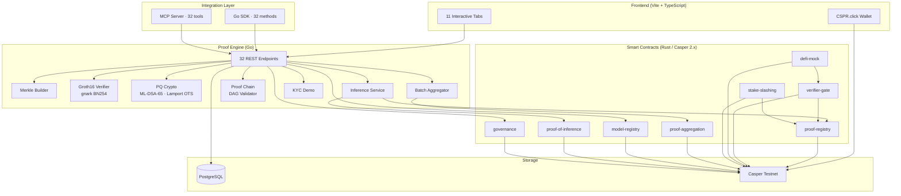
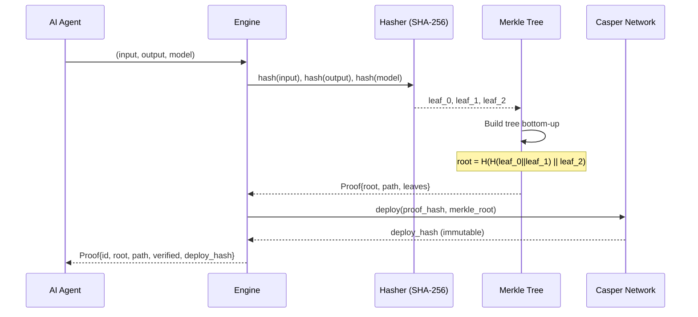
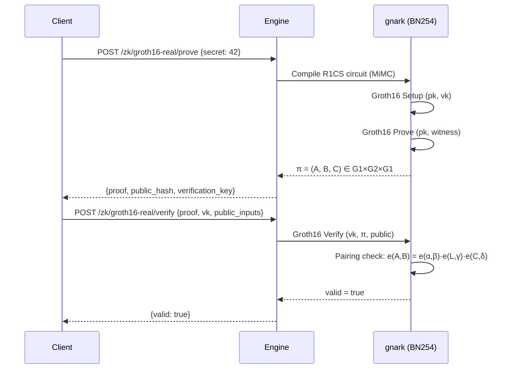
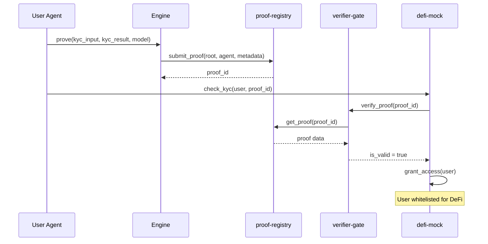
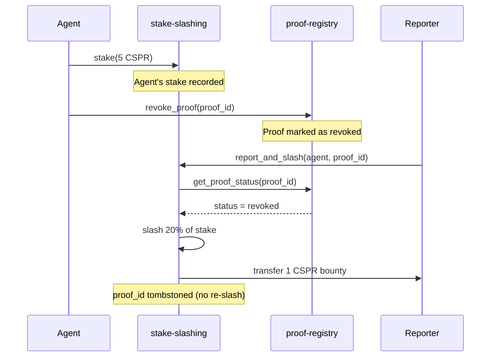

# Architecture

## System Overview



## Proof Generation



## ZK Proof Flow (Groth16)



## KYC Whitelisting Flow



## Stake & Slash Flow



## Verification Logic

```
Given: leaf L, path P = [p_0, p_1, ...], root R

verify(L, P, R):
    h = H(L)
    for p_i in P:
        h = H(h || p_i)   if index is even
        h = H(p_i || h)   if index is odd
    return h == R
```

## Security posture

Ownership model per contract, cross-contract call graph, reentrancy analysis and
renounce/timelock policy live in [`docs/SECURITY_AUDIT.md`](./SECURITY_AUDIT.md).
Short version: single-owner-per-contract, no irreversible `renounce_ownership`
anywhere, every cross-contract call is either read-only or a native purse
transfer (no callback surface). Any new privileged entry point MUST be added to
that audit before it merges.

Ownership cheat sheet (full detail + verdicts in `SECURITY_AUDIT.md` §1):

| Contract | Admin key | Mutable? | Renounce? | Verdict |
|---|---|---|---|---|
| `defi-mock` | `ADMIN_KEY` (deployer) | No | No | Safe |
| `verifier-gate` | none | — | — | Safe (read-only proxy) |
| `stake-slashing` | none | — | — | Safe (permissionless) |
| `proof-registry` | none (per-record `agent`) | per-record | No | Safe |
| `proof-of-inference` | `INSTALLER_KEY` | No | No | Advisory: hot deployer key |
| `model-registry` | `INSTALLER_KEY` + per-model `owner` | Per-model transferable | No | Safe, dual-tier |
| `proof-aggregation` | `INSTALLER_KEY` | No | No | Advisory: hot deployer key |
| `governance` | `owner`, 48h-timelocked transfer | Yes | No | Safe — see §2.9 |
| `zk-verifier` | `owner` (redeployed 2026-07-28 to dedicated wallet) | No direct rotation | No | Fixed and verified live — see §2.10 |

No contract exposes `renounce_ownership()` today — intentional, see
`SECURITY_AUDIT.md` §1 for the three preconditions that must ship before one
is ever added.
